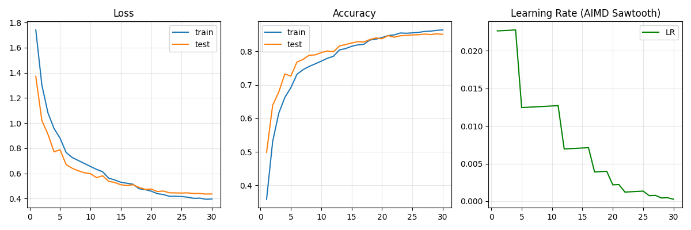

# 🚀 AIMD Learning Rate Scheduler for Neural Networks

> **Course Project:** Archaeology of Intelligent Machines
> **Team:** Eduard Dobrin, George Codreanu, Cristian Grigore

## 📖 Overview
This project explores an unconventional approach to optimizing Deep Learning models: applying the **TCP Congestion Control** mechanism (AIMD - Additive Increase Multiplicative Decrease) to the Learning Rate of a Neural Network.

Just as TCP manages packet flow to avoid network congestion, our custom scheduler treats **Validation Loss** as a "congestion signal". When the loss decreases, the learning rate grows linearly (probing for speed). When the loss spikes or stagnates, the learning rate is cut aggressively to stabilize the model.

## 📊 Key Results
We tested the method on **CIFAR-10** using a custom CNN architecture.

| Optimizer | Strategy | Test Accuracy |
|-----------|----------|---------------|
| SGD       | Fixed LR (0.01) | 83.2% |
| Adam      | Adaptive | 84.5% |
| **AIMD (Ours)** | **Auto-Tuned Scheduler** | **85.1%** 🏆 |

### Visualization (The "Sawtooth" Pattern)
The graph below demonstrates the AIMD behavior. Notice the **green line (Learning Rate)** forming a sawtooth pattern: it increases to find the optimal step size and drops sharply when instability is detected.

*(Note: Ensure `plots_aimd.png` is in the `results/` folder)*

## 🧠 Methodology

### The Algorithm
The scheduler updates the Learning Rate ($\eta$) at the end of each epoch:

1.  **Additive Increase (AI):** If `Loss_current <= Loss_prev`, we increase LR linearly:  
    $\eta_{t+1} = \eta_t + \alpha$
2.  **Multiplicative Decrease (MD):** If `Loss_current > Loss_prev` (Congestion/Divergence), we cut LR exponentially:  
    $\eta_{t+1} = \eta_t \times \beta$

### Automated Tuning with Optuna
To avoid manual guessing, we integrated **Optuna** to automatically search for the best hyperparameters ($\alpha$ and $\beta$).
* **Best Alpha:** `4.27e-5`
* **Best Beta:** `0.55`

